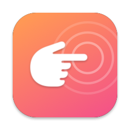
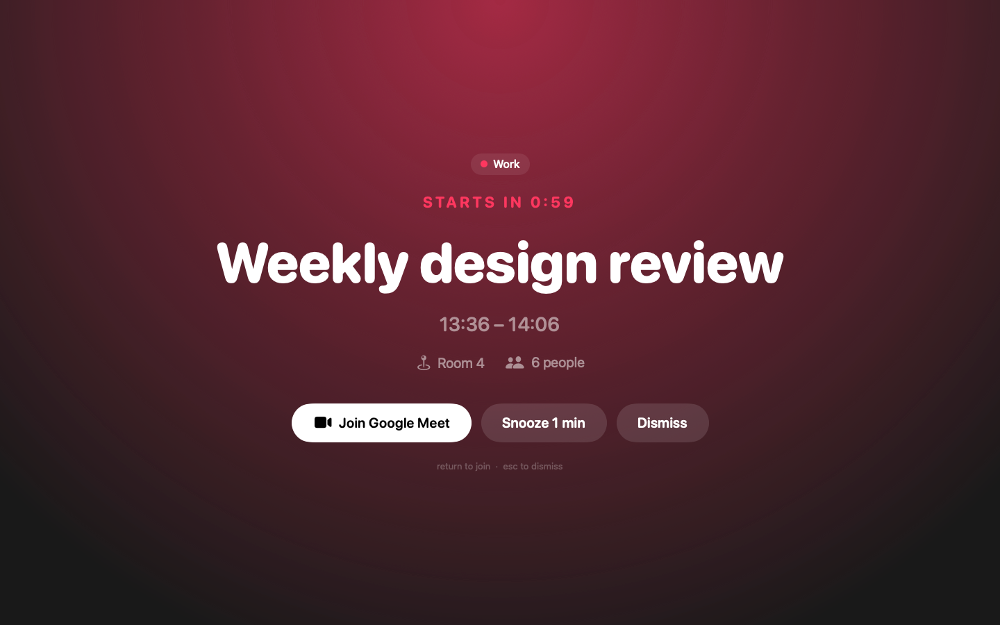

<p align="center">
  
</p>

<h1 align="center">PokeMe</h1>

<p align="center">
  <a href="https://github.com/Kaonashi-42/pokeme/actions/workflows/ci.yml"></a>
  
  <a href="https://github.com/Kaonashi-42/pokeme/releases/latest"></a>
  
  
</p>

A tiny macOS menu bar app that takes over your whole screen when a meeting is about to start, so you never miss one
again. Inspired by [In Your Face](https://www.inyourface.app/).



It reads the macOS Calendar database, so any account added to Calendar.app (iCloud, Google, Exchange, CalDAV…) works.

## Features

- **Full-screen poke** on every display, above full-screen apps and on every Space, with a sound.
- Shows the calendar, a live countdown, title, time range, location and attendee count.
- **One-click join** for Zoom, Google Meet, Teams, Webex, Whereby, FaceTime and Chime links found in the event URL,
  location or notes. <kbd>Return</kbd> joins, <kbd>Esc</kbd> dismisses.
- **Snooze** for one minute.
- Compact menu bar icon: hover it for the next meeting (`Standup in 12m`), click it for the rest of today's meetings.
- Configurable timing: at start, or 1, 2 or 5 minutes before.
- Pick which calendars to watch (new calendars are watched by default).
- Skips all-day, declined and canceled meetings. Back-to-back meetings are shown one after the other.
- Catches meetings that started up to 5 minutes ago, e.g. right after the Mac wakes up.
- Launch at login.

## Requirements

- macOS 14 Sonoma or later
- Xcode 16 or later (for the Swift 6 toolchain and `swift format`)

## Getting started

```sh
make install   # build, bundle, copy to /Applications and launch
```

On first launch, allow calendar access. Then use **Preview Overlay** in the menu to see the overlay without waiting for
a real meeting.

## Development

| Command        | What it does                                                   |
| -------------- | -------------------------------------------------------------- |
| `make`         | Lint, test and bundle `PokeMe.app`                             |
| `make test`    | Run the unit tests (`swift test`)                              |
| `make coverage`| Run the tests and print line coverage of `PokeMeCore`          |
| `make lint`    | Check style with `swift format lint --strict`                  |
| `make format`  | Auto-fix style issues                                          |
| `make app`     | Build a universal, ad-hoc signed `PokeMe.app`                  |
| `make package` | Zip the app as `PokeMe-<version>.zip` plus a SHA-256 checksum  |
| `make install` | Replace `/Applications/PokeMe.app` and relaunch it             |
| `make icon`    | Regenerate the app icon from `scripts/make-icon.swift`         |
| `make screenshot` | Render the overlay to `docs/overlay.png` for this README    |
| `make clean`   | Remove build output                                            |

`make app` and `make package` take an optional `VERSION=1.2.0`; it defaults to the version in `Info.plist`.

Linting uses `swift format`, which ships with the Swift toolchain, so there is nothing extra to install. Rules live in
[`.swift-format`](.swift-format) (4-space indent, 120 columns, no force unwraps or `try!`).

### Continuous integration

GitHub Actions runs on macOS:

- [`ci.yml`](.github/workflows/ci.yml): on every push and pull request, runs `make lint` and `make coverage`. The
  coverage table appears in the run summary; on `main`, the percentage is published to the `badges` branch for the
  README badge. Coverage is measured on `PokeMeCore`: the app target is thin platform glue without unit tests.
- [`release.yml`](.github/workflows/release.yml): started manually, see below.

### Releasing

In GitHub, open **Actions › Release › Run workflow** on `main` and pick which part of the version to bump
(`patch`, `minor` or `major`). The workflow:

1. lints and tests,
2. computes the next [semver](https://semver.org) tag from the latest `vX.Y.Z` tag (the first release starts from
   `v0.0.0`),
3. builds the universal (Apple silicon + Intel) app with that version and zips it with its SHA-256 checksum,
4. signs a build provenance attestation,
5. creates the tag and the GitHub release, with the short description of every commit since the previous tag as
   release notes.

It refuses to release when there are no new commits since the last tag.

Releases are ad-hoc signed, not notarized, so macOS blocks the first launch of a downloaded copy. After unzipping and
moving PokeMe to Applications, either open it once and click **Open Anyway** in System Settings › Privacy & Security,
or run:

```sh
xattr -dr com.apple.quarantine /Applications/PokeMe.app
```

Removing that step requires an Apple Developer ID certificate and notarization (`codesign --options runtime` +
`xcrun notarytool submit`) in the release workflow.

### Project layout

```
Sources/
  PokeMeCore/               Pure logic, no EventKit or AppKit, fully unit tested
    Meeting.swift             Calendar-agnostic meeting model and filtering
    MeetingLink.swift         Video-call link detection
    AlertScheduler.swift      Decides when to poke, once per occurrence
    Format.swift              Countdown, menu bar and time strings
    Settings.swift            UserDefaults-backed preferences
  PokeMe/                   The app
    main.swift                Entry point (menu bar only, no Dock icon)
    AppDelegate.swift         Wires everything together, polling and wake handling
    CalendarService.swift     EventKit access, maps EKEvent to Meeting
    StatusMenuController.swift Menu bar item and menu
    OverlayController.swift   Full-screen windows on every display
    OverlayView.swift         The SwiftUI overlay
Tests/PokeMeCoreTests/      Swift Testing suites for PokeMeCore
Info.plist                  Bundle metadata and calendar usage description
Resources/AppIcon.icns      App icon, generated by `make icon` from scripts/make-icon.swift
scripts/                    Icon generator and coverage report
docs/                       README images (icon, overlay screenshot)
PokeMe.entitlements         App Sandbox with calendar access only
.github/workflows/          CI and release pipelines
```

Anything that can be tested without a calendar or a screen lives in `PokeMeCore`; the `PokeMe` target is kept to thin
platform glue.

### How it works

Every 10 seconds (and whenever the calendar changes or the Mac wakes up) the app fetches today's events from the enabled
calendars, maps them to `Meeting` values and asks `AlertScheduler` whether one is due. If so and no overlay is showing,
it opens a borderless `.screenSaver`-level window on each screen.

## Security

Calendar invites can be sent by anyone, so their title, location and notes are treated as untrusted input:

- The app runs in the **App Sandbox** with the **hardened runtime**, and its only entitlement is calendar access.
- Only `https`/`http` links to known video services are offered as **Join**; anything else is ignored.
- The overlay's buttons and <kbd>Return</kbd>/<kbd>Esc</kbd> stay inactive for 0.8 s after it appears, so a keystroke
  or click meant for another app can't join a call by accident.
- Link detection scans at most 50,000 characters of event text.
- Event titles are never logged.

Releases carry a signed build provenance attestation. Check that a download was built by this repository's workflow
with:

```sh
gh attestation verify PokeMe-1.2.0.zip --repo Kaonashi-42/pokeme
```

## Troubleshooting

- **No meetings listed**: check System Settings › Privacy & Security › Calendars and make sure PokeMe has full access.
  The menu offers a shortcut when access is missing.
- **Calendar permission asked again after rebuilding**: the app is ad-hoc signed, so macOS treats every build as a new
  app. Sign it with a Developer ID certificate (`codesign --sign "Developer ID Application: …"`) to keep the
  permission across builds.
- **Logs**: `log stream --predicate 'subsystem == "com.pokeme.app"'`
# pokeme
